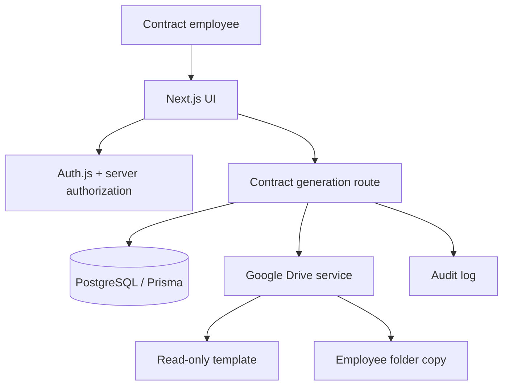
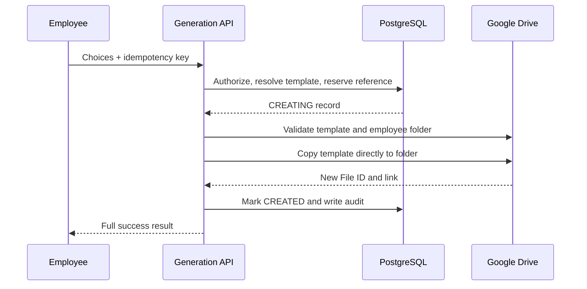

# Contract Management Center Architecture

## Context

Contract Management Center is a bilingual Arabic/English application that resolves an approved contract template from PostgreSQL, copies it through Google Drive on the server, certifies it as PDF with the selected company's stamp, signature, and placement settings, and records the complete operation. Google Drive filenames are descriptive only; a stored Google File ID is the source of truth.

## Runtime view

All Drive calls happen in the Node.js server runtime. The browser never receives OAuth refresh tokens, service-account credentials, or the original template File ID. Personal My Drive uses an encrypted OAuth refresh token; Workspace deployments can use a Service Account inside a Shared Drive.

## Generation sequence

If the same idempotency key is submitted twice, the existing operation is returned. The button is disabled while the request is pending, the key is unique in PostgreSQL, and a per-user rate limit is enforced from reserved generation rows.

## Modules

- `src/lib/contracts`: template resolution, file naming, orchestration, generation workflow.
- `src/lib/drive`: personal OAuth, Shared Drive Service Account and development mock implementations behind one interface.
- `src/lib/crypto`: AES-256-GCM protection for the stored Google OAuth refresh token.
- `src/lib/auth`: server-side role and row visibility checks.
- `src/actions`: authorized administrative and status mutations.
- `src/app/api`: Auth.js, Drive tests, generation and audited contract opening.
- `src/app/(protected)`: employee, supervisor and admin screens.
- `prisma`: schema, migration and repeatable development seed.

## Consistency boundary

PostgreSQL and Google Drive cannot share one atomic transaction. The application first creates a durable `CREATING` row, then copies in Drive, then marks it `CREATED`. A database write after a successful copy is retried. If both writes fail, a structured fatal log contains the request ID, local contract ID, and copied File ID for reconciliation; the Drive copy is not silently deleted.

## Access model

| Role | Contract scope | Administrative scope |
| --- | --- | --- |
| Contract Employee | Own contracts | None |
| Supervisor | Own contracts and direct reports | Templates, health tests, team audit |
| Admin | All contracts | All master data, users, settings, test copies |

Authorization is checked in every route/action and again when a stored contract link is opened.
